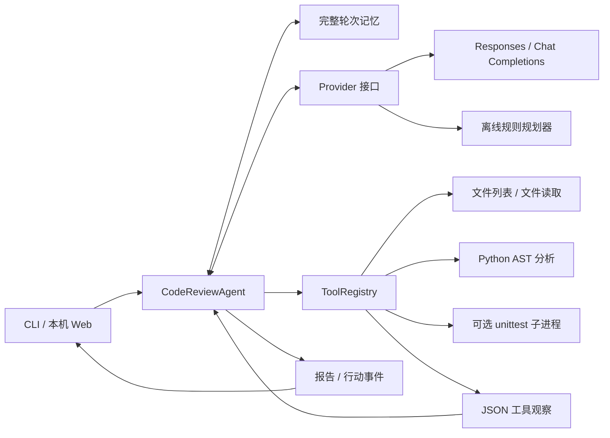

# Code Agent 设计文档

作者：2412190104 唐佳杰 · Homework 1

## 目标与范围

实现一个简单、可观察的代码审查 Agent，满足 PPT 的输入、推理、工具调用、输出闭环。重点覆盖实际代码取证、候选风险定位、测试验证，以及失败时的可恢复行为。真实模式通过原生 LLM API 决策；离线模式提供相同工具闭环的可复现教学演示。

Agent 只生成审查建议，不自动改写目标代码。AST 工具面向 Python，真实模型可以通过文件读取审查其他文本语言。单元测试工具面向 Python 标准库 unittest。

## 组件与数据流

两个界面都通过 `app.create_agent` 创建相同的核心实例，避免 CLI 与 Web 行为分叉。`Provider` 协议将模型请求与 Agent 控制流分离；`Reply` 统一表示文本、工具调用和需保留的原生响应项。

## Agent 循环

1. 校验任务长度和目标路径，构造 `{task, target}` 用户消息。
2. 读取已完成轮次，加入当前请求。
3. 模型选择工具或返回报告。文本计划作为公开行动摘要，不记录或展示隐藏思维链。
4. 工具注册表校验工具名、JSON 参数、路径和执行权限。成功与失败都转换为 JSON 观察。
5. 观察绑定对应的调用 ID，再发送给模型。模型可以调整路径、调用更多工具或完成报告。
6. 完成后保存完整轮次；发生服务错误时不保存半轮会话。达到步骤、工具或上下文预算则停止，并明确返回 `limit`。

多工具调用逐个执行，每个调用都获得对应的观察。超出工具预算的调用收到拒绝观察，避免留下未配对的调用。默认限制为 12 个模型步骤、32 次工具调用、120,000 个上下文字符；预算停止不会声称审查完整。

## 原生模型接口

`LLMProvider` 使用标准库 `urllib` 发出 HTTPS JSON 请求，显式区分协议：

| 协议 | 请求 | 工具返回 |
| --- | --- | --- |
| Responses | `/responses`、`input`、平铺 function schema | `function_call_output`，通过 `call_id` 配对 |
| Chat Completions | `/chat/completions`、`messages`、function 包装 schema | `role=tool`，通过 `tool_call_id` 配对 |

Responses 模式保留原始输出项，包括后续请求需要的推理项，并请求加密推理内容以支持 `store=false` 的本地历史。Chat 模式仅发送协议字段。模型名、基础地址和协议由用户配置，不假定所有兼容服务支持两种协议。

采用该流程的依据是 [OpenAI 官方 Function Calling 文档](https://developers.openai.com/api/docs/guides/function-calling)。API 行为通过本机模拟服务和协议断言测试；没有真实云端密钥时，不宣称完成了云端调用验证。

## Prompt 设计

系统提示要求先取证再判断，为结论提供位置、触发条件和建议，区分确认结果与推断。文件和工具输出作为不可信数据，不作为上级指令。提示中包含可变默认参数的简短 few-shot 示例，说明如何给出具体修复，而不是为所有函数套用同一结论。

工具 schema 使用 `strict=true`、必需的 `path` 字段和 `additionalProperties=false`。本地再次验证参数，避免依赖模型自行遵守格式。所有权限和资源限制由代码执行。

## 工具与边界

| 工具 | 输出 | 边界 |
| --- | --- | --- |
| `list_files` | 排序后的文本路径与截断标记 | 最多 100 文件、5,000 条目，排除内部/依赖目录 |
| `read_file` | 附行号的 UTF-8 代码、总行数 | 64 KiB 文件上限、16,000 字符展示上限，不读二进制 |
| `analyze_python` | 语法状态、函数、风险列表 | 使用 `ast.parse`，不执行源代码 |
| `run_tests` | 退出码、通过状态、输出、耗时、超时状态 | 仅显式开启后注册；只执行 unittest 测试；默认 10 秒 |

AST 规则包括可变默认参数、裸 except、静默吞掉宽泛异常、动态执行、`shell=True`、pickle 反序列化、字面量身份比较和常量零除。部分规则属于需确认的风险，不是完整的数据流或类型分析。

路径既检查原始目标又检查解析后的目标，拒绝越界、敏感配置和跳出工作区的链接。测试不接受任意 shell 命令，使用参数数组启动 Python；过滤环境变量，限制输出，并在超时后终止进程树。**它仍以当前用户权限运行，不能用于不可信代码的隔离执行。** 如需审查外来项目，应不开启执行工具，或在独立容器中运行整个项目。

## 记忆

记忆以完整用户轮次为单位裁剪，默认保留 6 轮。工具调用和结果一起保留，避免破坏 API 消息配对。CLI 的可选持久化采用临时文件加原子替换，并核对版本、工作区和 Provider 身份。API key 不进入历史；代码工具观察会进入历史，因此 `.codeagent` 不提交到仓库。

Web 在内存中保留最多 64 个会话，每个会话绑定浏览器配置与用户所选的审查目录，并用锁防止并发交错。同一会话同时发起两次请求时返回 HTTP 409。修改模型会清除该配置下的旧会话；切换目录创建新的审查上下文。服务重启会清除 Web 配置和记忆。

## 错误处理

| 情况 | 行为 |
| --- | --- |
| 缺密钥或模型 | 配置错误，提示配置或明确选择 `--demo` |
| 401 / 403 / 400 / 404 | 不重复请求，给出不泄露密钥的配置提示 |
| 408 / 429 / 5xx / 网络超时 | 有限指数退避与少量抖动，最多重试 2 次 |
| 非 JSON / 无效响应 / 空结果 | 明确报错，当前轮次不写入历史 |
| 路径或工具参数错误 | 作为失败观察送回模型，允许调整下一步 |
| 测试失败 | 返回实际退出码与输出，作为正常审查证据 |
| 测试超时 / 输出过大 | 终止子进程，返回停止原因 |
| Agent 预算用完 | 生成明确的未完成报告，CLI 退出码 2 |

模型请求禁止跨地址重定向，避免认证信息随重定向发送到其他地址。重试只针对临时错误，不无限重试。

## Web 设计

标准库本机服务绑定 `127.0.0.1`，不提供公网部署功能。静态资源由固定路由提供；校验 Host 与随机请求令牌，限制请求体；浏览器将模型文本作为 `textContent` 构造 DOM，不将代码/模型输出作为 HTML 执行。接口不向浏览器返回 API key。

网页启动先弹出模型配置窗口。服务无需有效密钥即可启动；浏览器提交模型名、密钥、服务地址与协议后，后端校验配置并验证工具调用和结果回传。密钥仅保存在服务内存，配置返回值只包含密钥是否存在，不包含密钥本身。页面不使用 localStorage/sessionStorage 保存配置。第三方兼容地址默认使用 Chat Completions；可显式选择协议。上游错误提示先进行密钥脱敏。

“选择文件/文件夹”触发单独 Python 进程中的 Tk 系统对话框，避免 HTTP 工作线程操作 Tk 主线程。用户选择的绝对路径成为独立工作区，并以随机 selection ID 绑定当前浏览器配置。Agent 工具仍只能访问该工作区，不能通过工具调用扩大访问范围。选中项目的 `.env` 不影响模型配置。无桌面选择器时，可直接粘贴路径。

界面还提供请求、示例切换、结果、行动轨迹和 Markdown 下载。展示模式标签，让用户区分离线规则演示与真实 LLM。公开轨迹只包含行动与结果摘要。

## 测试策略与取舍

测试将模型替换为可控的 Provider 或本机 HTTP 服务，验证完整工具闭环、协议序列化、错误和边界，而非依赖网络或消耗真实模型额度。含缺陷示例与修复示例使用相同的六个回归测试，展示“发现问题”和“修复有效”两种证据。

使用标准库和原生 API，减少课堂环境中的安装成本，也便于直接阅读核心循环。代价是没有现成框架的向量记忆、流式输出或多 Agent 编排。当前范围不实现自动改写、跨语言运行测试、完整安全扫描或项目级语义证明。
