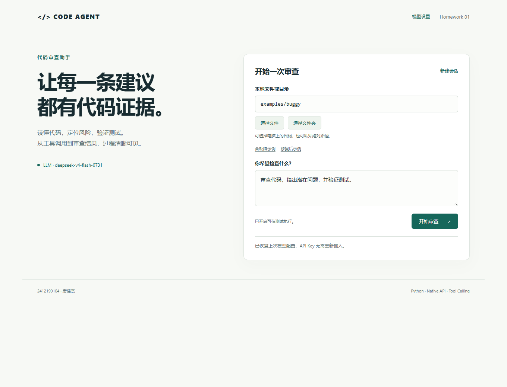

# Code Agent：代码审查助手

Homework 1

一个可以运行和检查执行过程的代码审查 Agent。通过原生 LLM API 决定下一步操作，调用文件读取、Python AST 分析和可选的单元测试工具，再依据结果生成带位置与修复建议的报告。提供命令行、多轮聊天和本机 Web 界面。

项目地址：[dankingzzzing/Code-Agent](https://github.com/dankingzzzing/Code-Agent)

## 30 秒运行

需要 **Python 3.10 或以上**。应用运行只使用 Python 标准库，不需要安装 LangChain、模型 SDK 或 Web 框架。从项目根目录运行：

```powershell
python -m code_agent review examples/buggy --demo --allow-exec --trace
python -m code_agent serve --allow-exec
```

打开 [http://127.0.0.1:8765](http://127.0.0.1:8765)，首次使用会弹出“连接你的模型”窗口。填写 API Key、模型名称与服务地址，勾选“在本机记住此配置”，点击“验证并进入”；刷新页面或重启服务后会恢复配置。没有密钥时可点击“使用离线演示”。Web 服务启动不要求预先配置 `.env`。

进入页面后，点击“选择文件”或“选择文件夹”，通过电脑的系统窗口选择任意本地项目；也可以粘贴绝对路径。选中目录自动成为当前审查工作区，选中单个文件则使用其所在目录。点击“含缺陷示例”或“修复后示例”可返回内置演示。



**`--demo` 是可复现的离线规则规划器，不调用 LLM，不需要 API key。** 它与真实 LLM 共享 Agent 循环、工具、观察结果、记忆和界面，但仅支持预设的 Python 审查规则，不支持任意业务推理或通用自然语言问答。

**`--allow-exec` 只应用于可信的本地测试。** 默认只读取和静态分析；开启后 unittest 会以当前用户权限运行 Python 代码。超时、环境变量过滤和输出限制不构成操作系统沙箱。

## 功能

| 能力 | 实现 |
| --- | --- |
| Agent 循环 | 用户任务 → 模型规划 → function calling → 工具观察 → 再次规划 → 报告 |
| 真实 LLM | `responses` 原生接口和 `chat_completions` 兼容接口，可配置基础地址与模型 |
| 工具 | `list_files`、`read_file`、`analyze_python`、可选 `run_tests` |
| 审查证据 | 文件、行号、规则、严重程度、触发条件和修复建议 |
| 交互 | 批量 CLI、带记忆的交互聊天、本机 Web |
| 网页模型设置 | 启动弹窗，填写密钥/模型/服务地址，真实验证工具调用与结果回传 |
| 配置保存 | Windows 当前用户加密保存密钥，刷新与服务重启自动恢复，密钥不回显 |
| 实时进度 | 即时显示扫描、完整源码读取、审查批次、证据核验与测试；报告流式输出 |
| 目录报告 | 完整文件分批审查、覆盖表、源码证据核验、逐文件结果、实际测试状态 |
| 本地选择 | 系统文件/文件夹选择器，支持启动目录以外的项目和绝对路径 |
| 上下文记忆 | 保留完整工具调用轮次，可保存并继续 CLI 会话 |
| 错误处理 | 工具错误作为观察返回；临时 API 错误重试；失败轮次不污染记忆 |
| 可观察性 | `--trace` 行动轨迹，`--json` 结构化导出，Web 报告下载 |
| 资源限制 | 工作区路径校验、文件大小、循环/工具预算、上下文长度、测试超时 |

## 配置真实 LLM

**网页推荐方式**：直接运行 `python -m code_agent serve --allow-exec`，在启动弹窗中填写配置。接口协议默认“自动选择”；第三方兼容服务优先选择 Chat Completions，OpenAI 官方服务选择 Responses。可以随时点击页面右上角“模型设置”重新配置。更改模型或目录会开启新的审查会话。

“验证并进入”会实际检查一次工具调用和一次工具结果回传，确认 Agent 能工作，而不仅是模型能返回文本。失败时弹窗会显示经密钥脱敏的服务错误，保留所填配置供修改。

勾选“在本机记住此配置”后，验证成功的设置保存到启动目录的 `.codeagent/web-settings.json`。Windows 使用当前登录用户的 DPAPI 加密保护密钥；其他系统使用权限为 `0600` 的私有文件，属于文件权限保护。密钥不写入 `.env`、浏览器 localStorage/sessionStorage、报告或 GitHub；`.codeagent` 已被 Git 和提交包排除。页面通过 HttpOnly、SameSite Cookie 恢复配置 ID，密钥输入框保持空白，表示“留空沿用”，无需再次填写。

已保存的网页配置优先于启动目录的 `.env`。取消记住并成功应用设置会删除保存文件；当前服务仍可在刷新后恢复，服务重启需要重新配置。验证失败不会覆盖上次成功的设置。需要更换密钥时，在“模型设置”填写新密钥并验证。启动目录已有 `.env` 时可沿用其中的密钥并预填地址和模型；选中其他项目后，不加载那个项目的 `.env`。更换服务地址需要重新填写对应密钥。

审查开始后立即显示公开执行进度与耗时：扫描了什么、读取了什么、正在审查哪批文件、核验了多少发现、实际测试结果。报告生成时逐段显示文字。这些是行动与证据摘要，服务返回的隐藏推理内容不会显示。

目录审查默认最多读取 **40 个代码文件、500,000 个源码字符**，每个文件最多 **64 KiB**；按完整文件分批发送给模型，保留项目说明和精确行号。应用核验模型报告的路径、行号和源码引文，剔除无法核验的发现。最终报告附带覆盖表、逐文件结果、修复与回归测试建议、实际测试输出和未覆盖原因；达到文件或模型预算会明确标记未完成。离线目录模式检查所有选中文件，不再只抽取六个文件；非 Python 文件仅能读取，无法做 AST 语义判断。

**命令行方式**仍支持 `.env`：

复制配置模板：

```powershell
Copy-Item .env.example .env
```

在 `.env` 中填入自己的密钥、可用模型和服务基础地址。环境变量优先于 `.env`；密钥只用于服务端 API 请求，不会写入报告或浏览器存储。

```dotenv
LLM_API_KEY=填入你的密钥
LLM_MODEL=填入支持工具调用的模型名
LLM_BASE_URL=https://api.openai.com/v1
LLM_API_STYLE=auto
```

然后运行，**省略 `--demo`**：

```powershell
python -m code_agent doctor
python -m code_agent review examples/buggy --allow-exec --trace
python -m code_agent serve --allow-exec
```

`doctor` 检查配置是否齐全，不发送请求，也不验证密钥有效性。

`LLM_API_STYLE=auto` 根据服务地址选择协议；也可显式配置为 `responses` 或 `chat_completions`。基础地址或完整 `/chat/completions`、`/responses` 地址都可输入，应用会规范化路径。模型必须支持 function calling；两种 API 不能仅凭更换模型名互换。接口实现依据 [OpenAI 官方 Function Calling 文档](https://developers.openai.com/api/docs/guides/function-calling)。

没有配置密钥时，网页仍正常启动并提供配置弹窗，CLI 真实审查模式明确报错。应用不会自动回退到离线模式。本次更新已用本机已有的用户配置验证真实模型工具调用和代码审查；常规自动测试使用模拟服务，不携带密钥。

## 命令行用法

```powershell
# 审查单个文件，默认不执行代码
python -m code_agent review examples/buggy/calculator.py --demo

# 自定义工作区和问题；目标路径相对于 --root
python -m code_agent review src --root D:/your-project --task "检查异常处理与边界输入"

# 将报告和完整行动轨迹导出为 JSON
python -m code_agent review examples/buggy --demo --allow-exec --json --output artifacts/review.json

# 多轮聊天；下次使用同一个会话名继续
python -m code_agent chat --demo --target examples/buggy --session homework1

# 真实 LLM 会话；不同模型或 API 使用不同会话名
python -m code_agent chat --target examples/buggy --session llm-review

# 调整本机 Web 端口
python -m code_agent serve --demo --allow-exec --port 8765
```

聊天中输入 `/exit` 退出，`/reset` 清空记忆。CLI 会话保存在工作区 `.codeagent/sessions/`，包含用户输入、代码观察和回答，请不要上传；该目录已加入 `.gitignore`。Web 审查会话和所选目录在服务内存中保存，服务重启后重新选择目录；勾选记住的模型配置会恢复。

可选安装为命令：`python -m pip install .`，随后使用 `code-review-agent review ...`。不安装也可以直接从源码运行。

退出码：`0` 表示审查流程完成，`1` 表示配置、路径或服务错误，`2` 表示达到 Agent 预算，`130` 表示用户中止。**审查完成不等于被审查代码的测试通过**；测试通过/失败记录在报告和 `run_tests` 观察中。

## 示例与验证

`examples/buggy` 含故意保留的缺陷：空列表除零、可变默认参数、`eval` 解析用户输入、异常静默吞掉。`examples/fixed` 提供相同功能契约的修复。两份 `test_calculator.py` 使用相同的六个回归测试。

```powershell
# 项目自身的单元/集成测试
python -m unittest discover -s tests -v

# 修复版本，应全部通过
python -m unittest discover -s examples/fixed -v

# 含缺陷版本，预期失败，用来验证 Agent 能看到实际失败证据
python -m unittest discover -s examples/buggy -v

# 由 Agent 工具运行并观察两种版本
python -m code_agent review examples/buggy --demo --allow-exec
python -m code_agent review examples/fixed --demo --allow-exec
```

测试覆盖 Agent 工具闭环、追问上下文、预算停止、失败回滚、API 两种协议、瞬时错误重试、认证失败、工作区越界、敏感文件、文件上限、测试超时、CLI 和 Web 请求。GitHub Actions 在 Linux / Windows、Python 3.10 / 3.13 上运行检查。符号链接测试在无法创建链接的 Windows 环境中明确跳过。

更多交付证据见 [验证记录](docs/VALIDATION.md)，演示步骤见 [一分钟演示](docs/DEMO.md)。

实际操作视频：[41.92 秒演示录像](docs/assets/demo.mp4)（无配音）。

## 目录与设计

```text
code_agent/
  agent.py        Agent 循环、预算与行动事件
  project_review.py 完整目录分批审查、证据核验与项目报告
  providers.py    Responses / Chat Completions / 离线规划器
  tools.py        文件、AST 与可信测试工具
  analysis.py     Python 静态规则
  memory.py       完整轮次记忆和本地持久化
  prompts.py      系统提示与 few-shot 示例
  config.py       环境/网页配置、接口规范化和校验
  settings_store.py 本机配置保存与 Windows DPAPI 密钥保护
  app.py          共享装配入口
  cli.py          命令行与多轮聊天
  web.py          本机 HTTP 服务、模型设置与审查目录切换
  file_picker.py  独立进程中的系统文件/目录选择器
  static/         无外部依赖的 Web 界面
examples/         含缺陷 / 修复示例
tests/            项目自动测试
docs/             作业要求、演示和验证说明
scripts/          提交包生成脚本
```

完整设计见 [DESIGN.md](DESIGN.md)。PPT 将设计文档拼写为 `Desgin.md`，本仓库也提供同名入口。[要求逐项对应](docs/REQUIREMENTS.md)说明各评分项的实现位置。
