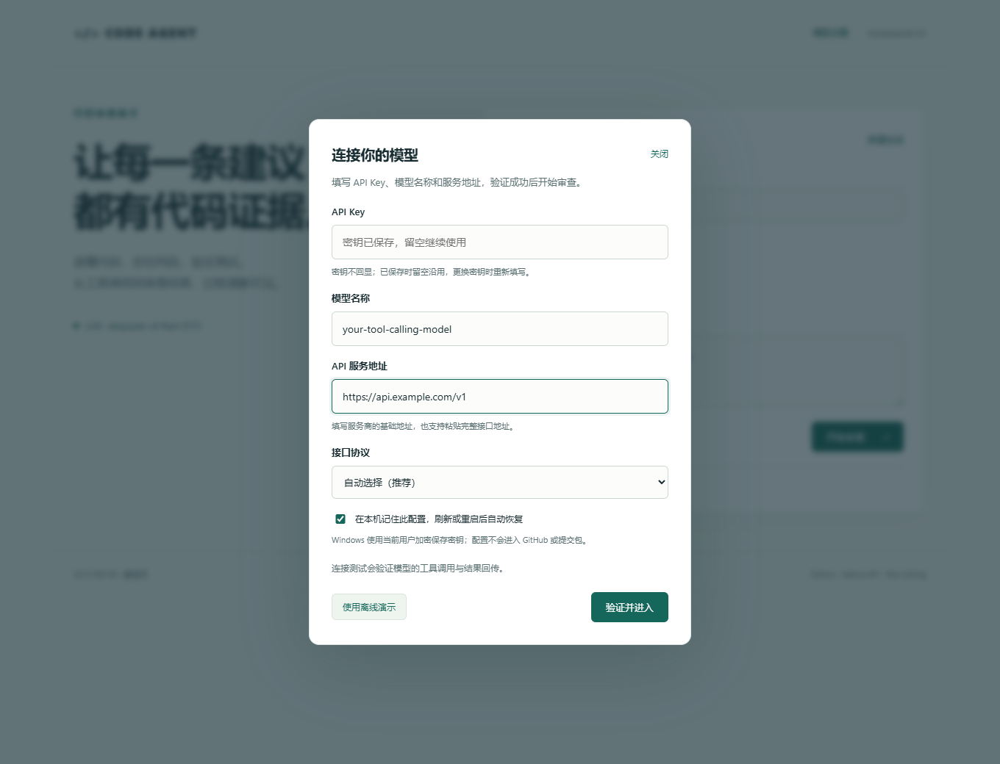
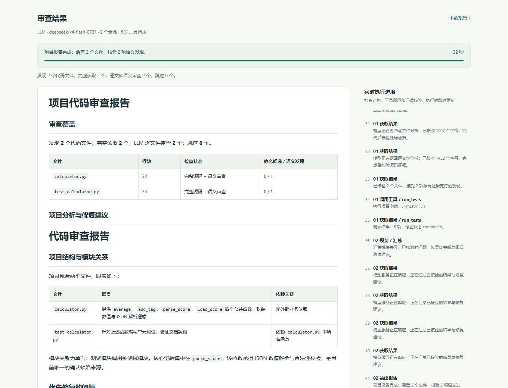

# 交付验证记录

日期：2026-10-07（Asia/Shanghai）

本地环境：Windows，Python 3.13.9，Microsoft Edge（无头浏览器）。应用运行使用标准库；浏览器检查工具只安装在被忽略的 `.qa` 目录，不属于应用依赖。

## 自动测试

| 检查 | 实际结果 |
| --- | --- |
| `python -m unittest discover -s tests -v` | 74 项，73 通过、1 跳过、0 失败 |
| Windows 符号链接逃逸测试 | 本机不允许创建 symlink，明确跳过；Linux CI 会执行 |
| `python -m unittest discover -s examples/fixed -v` | 6 项全部通过 |
| 含缺陷示例的 unittest 结果 | 6 项：2 通过、3 失败、1 错误（预期） |
| 含缺陷目录离线审查 | 完整读取 2 个文件、6 次本地工具操作、4 条 AST 候选，报告包含测试失败输出 |
| 修复目录离线审查 | 完整读取 2 个文件、6 次本地工具操作、静态规则无发现，测试退出码 0 |
| `node --check`（app.js / markdown.js） | 通过 |
| Python wheel 构建 | 成功，检查包含 HTML/CSS/JS 静态资源 |
| 浏览器操作录像 | 41.92 秒，H.264 / MP4，实际页面交互，已抽取中段和末段画面检查 |

工具与核心测试覆盖路径逃逸、敏感文件、JSON 参数、输出上限、测试超时、密钥环境过滤、未找到测试、记忆与失败轮次、API 格式与重试。新增测试覆盖无密钥启动、网页模型配置、工具连接验证、密钥不回显、配置与目录隔离、原工作区以外的文件/目录、取消选择和更换模型后的会话失效。常规自动测试用本机模拟服务，不访问付费模型。

1.2.0 新增检查覆盖 DPAPI 保存/解密与损坏配置、Cookie 刷新恢复、服务重启恢复、失败验证保留成功配置、取消记住、首个进度事件早于审查完成、401 信号、两种 SSE 协议、工具参数分片、隐藏推理不进入公开输出、强制工具验证、流缺少完成标记、目录超过六文件、完整源码与行号、假源码证据剔除、遗漏语义审查、预算与大文件、未找到测试和目录追问记忆。

## 浏览器交互

实际通过 Edge 操作验证：

- 首页显示离线模式与作者信息。
- 含缺陷示例产生带行号的发现，并展示真实的 ZeroDivisionError 和失败断言。
- 行动轨迹包含读取、AST 和 unittest 调用。
- Markdown 报告可下载。
- 同一会话切换到修复示例，六个测试通过。
- 新建会话清除界面中的旧结果。
- 工作区外路径显示错误。
- 390 像素窄屏下没有横向溢出。
- 页面没有 JavaScript 运行错误。

1.1.0 新增的实际检查（Windows + Edge）：启动模型弹窗、沿用本机已有密钥并验证真实工具闭环、从系统文件对话框选中临时项目的 Python 文件并完成真实模型审查、从系统文件夹对话框选中该目录并完成离线审查、报告下载、390 像素下的弹窗布局。文件和文件夹位于启动工作区之外。浏览器 localStorage/sessionStorage 为空，未持久化密钥。

1.2.0 真实接口检查：使用用户更新的本机 `.env` 密钥，强制工具调用与结果回传通过；目录完整审查并核验 2 个文件、4 项真实源码发现，实际运行 6 个测试并保留预期失败输出。批次和报告改用流式请求，避免非流式长报告在默认读取超时后重复请求。一次带详细诊断的完整审查耗时约 107 秒，耗时随模型与服务状态变化；流式阶段仅公开执行状态与答案。Windows 保存文件使用 DPAPI，重启后恢复的密钥与本机 `.env` 一致，GET 不返回密钥。

浏览器真实目录审查使用默认 45 秒连接/读取超时，完整流程约 119 秒，完成期间服务持续返回流事件；页面即时显示源码读取、模型正在响应、接收逐文件分析、证据核验和测试结果。最终覆盖 2 个文件、4 项模型发现，报告渲染 4 张表格并可下载；浏览器端密钥输入保持空白，刷新后自动恢复配置。

修复目录也通过真实模型完成审查，实际六个回归测试全部通过。单独的浏览器渲染检查验证了 390 像素报告与弹窗布局、超长文件名换行、Markdown 表格与代码围栏；HTML 和 `javascript:` 链接不会执行，页面无 JavaScript 运行错误。

实际截图：

完整缺陷截图：[web-buggy.png](assets/web-buggy.png)。视频与演示步骤见 [DEMO.md](DEMO.md)。

## 验证范围

本次更新使用用户在本机已配置的第三方兼容服务完成了真实云端工具调用、结果回传和代码审查。该服务的 Responses 文本请求能返回内容，但本次工具验证没有返回工具调用；Chat Completions 工具闭环通过。应用默认自动选择协议，并在网页中执行真实工具验证。个人密钥不进入源代码、截图或压缩包。离线演示清楚标明“非 LLM”。

GitHub CI 配置覆盖 Linux / Windows 和 Python 3.10 / 3.13；本地结果不替代这些远程环境的实际运行结果。含缺陷示例故意失败，CI 检查其 Agent 流程完成，而不是要求缺陷代码通过测试。
